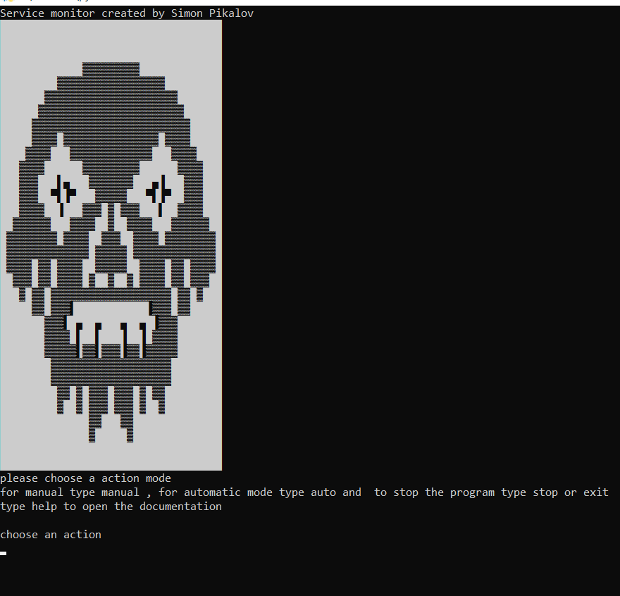
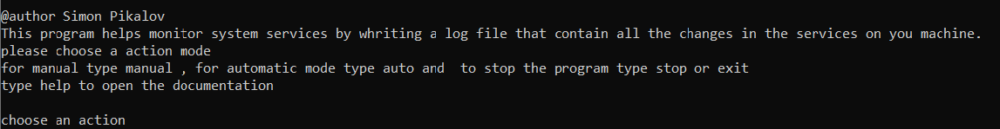
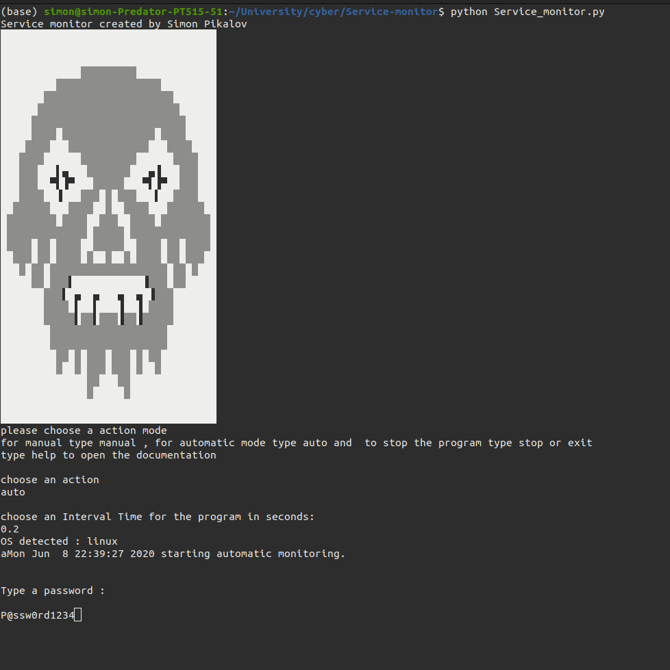
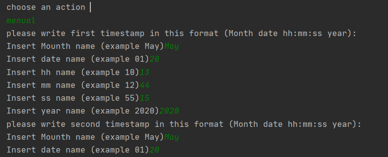
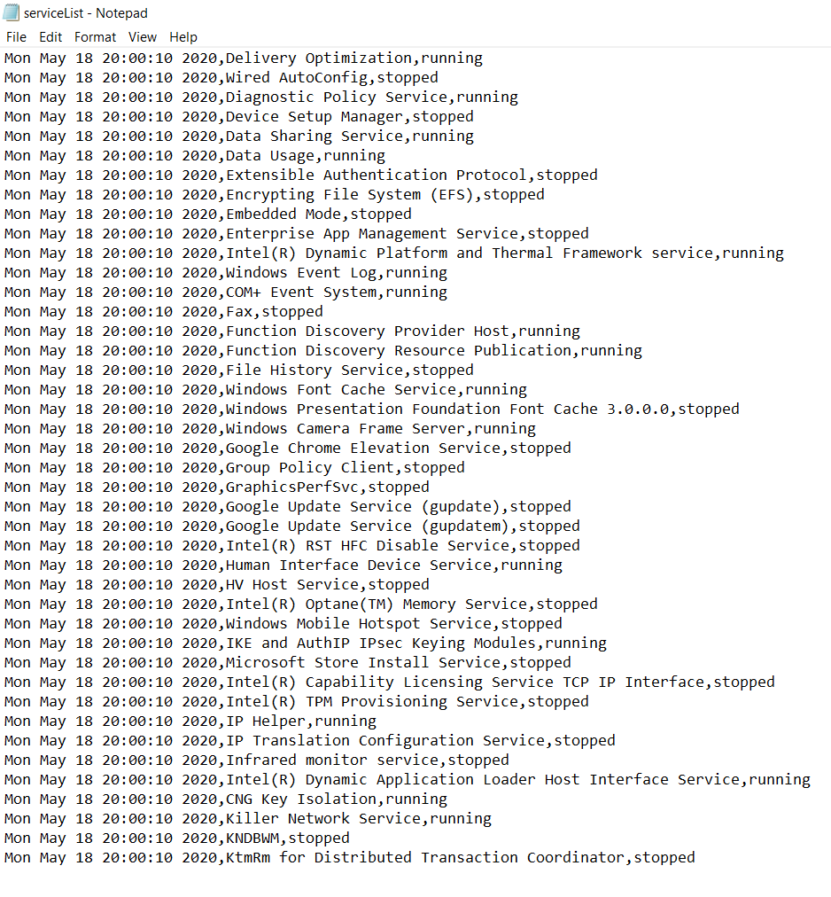
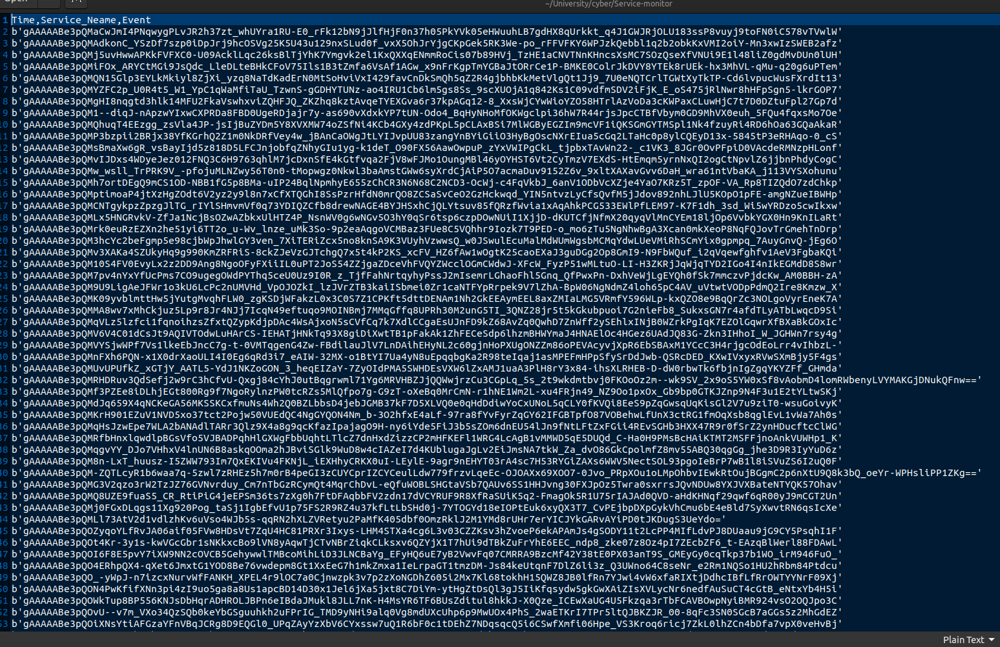
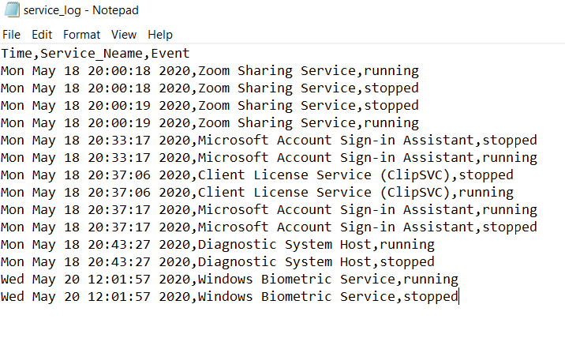

# Service monitor
This  project represents a Program for cross-platform service monitor for Windows and Linux 
The program is designed to help notice a problems in a services of a computer 
the program have two modes of doing that automatic and manual.  
  
 
 # Main features : 
  
  - Command line  Based User interface with interactive control's
  - write a all the service running to a log file. 
  - Manual mode of comparing two time stamps from log file 
  - Automatic  mode with a user defined timestamp where all the event's atre being writen to a log file .
 

  
### Installation
To Run the Program you must import Subprocess wich is not in the Python standart lib
you can install it with the command

Pull the file from the Git repository with the command : 
```sh
$ git clone https://github.com/simon-pikalov/Service-monitor.git

```
 
Then 
to install the requirements run the command 
```sh
$ pip install -r requirements.txt

```


# The Program


### help menu  : 
Type help


### Auto Mode : 
Type auto and then choose a time stamp for intervals of the program to run. 



### Menual Mode : 
Type menual and then type the time info



### Log file (decrypted)  : 
This log file show's all the services running on your computer with a interval that the user chooses 


### Log file (encrypted)  : 
This log file show's all the services running on your computer with a interval that the user chooses 


### Event Log file (decrypted)  : 
This log file show's all the services changed on your computer compered to the previous log.



   


